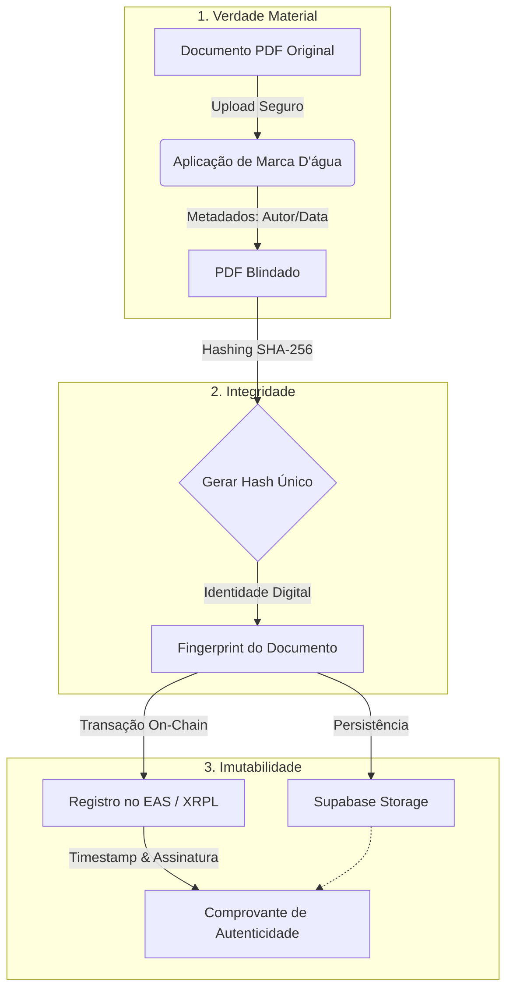

# GovChain | Protocolo da Verdade Híbrida


> **Sistema de Governança Institucional e Liquidação Transparente para a COOPERSMERALDA.**

O **GovChain** é uma plataforma descentralizada (dApp) que implementa a "Tripla Blindagem" de documentos e processos decisórios, garantindo integridade matemática, jurídica e social para a cooperativa.

---

## 🏛️ Arquitetura da Tripla Blindagem

O coração do sistema opera através de um fluxo de validação em três etapas, garantindo que nenhum documento possa ser alterado retroativamente sem detecção.



## ✨ Funcionalidades Principais

### 1. Governança & Compliance
- **Upload Blindado**: Registro de Atas, Pautas e Contratos com carimbo de tempo on-chain.
- **Auditoria em Tempo Real**: O Conselho Fiscal possui acesso a um painel de verificação independente.
- **Validação Jurídica**: Fluxo de aprovação de templates e pareceres pelo Conselho Jurídico.

### 2. Gestão Financeira (DeFi)
- **Split de Pagamentos**: Divisão automática de receitas entre Cooperativa e Garimpeiros.
- **Liquidação D+0**: Uso de trilhos cripto (RLUSD/XRP) para pagamentos instantâneos.
- **Escrow Automatizado**: Garantia de fundos via Smart Contracts (XRPL Escrow).

### 3. Identidade & Acesso (RBAC)
Sistema granular de permissões baseado em **Roles** (Cargos):
- `Admin`: Conselho Deliberativo (Gestão Total).
- `Fiscal`: Auditoria e Visualização de Saldos.
- `Legal`: Validação de Contratos e Compliance.
- `Member`: Votação e Consulta.

## 🛠️ Stack Tecnológica

| Camada | Tecnologia | Função |
|--------|------------|--------|
| **Frontend** | Next.js 14 (App Router) | Interface Reativa e SSR |
| **UI/UX** | Shadcn/UI + Tailwind | Design System Institucional |
| **Web3** | Thirdweb SDK | Conexão de Carteiras e Smart Contracts |
| **Backend** | Supabase | Banco de Dados Relacional e Auth |
| **Blockchain** | XRPL / Base Sepolia | Camada de Liquidação e Registro |

## 🚀 Como Executar Localmente

### Pré-requisitos
- Node.js 18+
- Chaves de API (Supabase, Thirdweb) configuradas.

### Instalação

1. **Clone o repositório**
   ```bash
   git clone https://github.com/seu-org/govchain.git
   cd elos
   ```

2. **Instale as dependências**
   ```bash
   npm install
   ```

3. **Configure o Ambiente**
   Duplique o arquivo de exemplo e preencha com suas chaves:
   ```bash
   cp .env.local.example .env.local
   ```

4. **Inicie o Servidor**
   ```bash
   npm run dev
   ```
   Acesse: `http://localhost:3000` (ou porta indicada no terminal).

## 🔐 Segurança e Compliance

Este projeto segue rigorosos padrões de segurança:
- **Zero-Knowledge Logs**: Nenhuma chave privada é logada no servidor.
- **Isolamento de Segredos**: Uso estrito de variáveis de ambiente não versionadas.
- **RBAC Nativo**: Permissões validadas tanto no Frontend quanto nas Security Rules do Banco de Dados.

## 📄 Licença

Todos os direitos reservados à **COOPERSMERALDA**.
O código fonte é proprietário e seu uso não autorizado é proibido.
